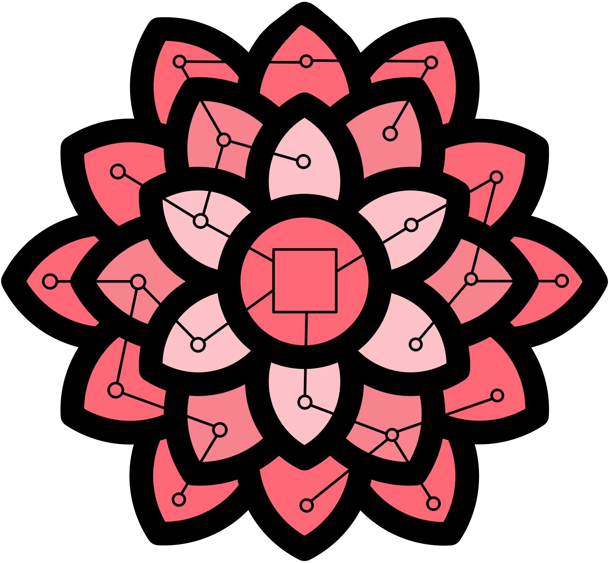
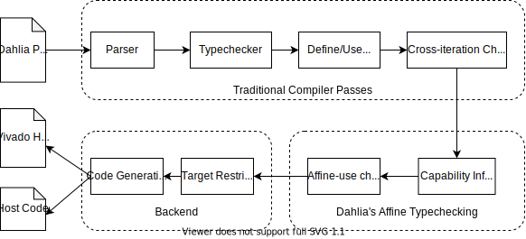

<h1>
<p align="center">

</p>
<p align="center">
The Dahlia Programming Language
</p>
</h1>

[](https://circleci.com/gh/cucapra/dahlia)

Dahlia is a programming language for designing hardware accelerators.  It
provides abstractions that guarantee predictable hardware generation after type
checking. For more details, see [the demo][demo] and [the documentation][docs].

Fuse is the reference compiler for compiling Dahlia programs to various HLS
backends. Vivado HLS is the only currently supported backend.

[docs]: https://capra.cs.cornell.edu/fuse
[demo]: https://capra.cs.cornell.edu/dahlia

## Set It Up

The compiler is written in [Scala][].
To get things running, you will need a Java runtime, Scala itself, and [sbt][].
Here's what you need to do:

- Get Java if you don't already have it.
  - For MAC OS: `brew tap AdoptOpenJDK/openjdk && brew cask install adoptopenjdk8`.
  - **NOTE**: The default adoptopenjdk (Java 13) version does not work with SBT.
- Install Scala and sbt. On macOS, use `brew install scala sbt`.
- Install [Runt][] to run integration tests:
  ```
  cargo install runt \
    --version "$(grep ver runt.toml | awk '{print $3}' | tr -d "'")"
  ```

- Now you can compile the compiler by typing `sbt assembly`.
- Use `sbt test` to run the tests
- Use `runt` to run the integration tests from the repository root.

[scala]: https://www.scala-lang.org/
[sbt]: https://scala-sbt.org
[homebrew]: https://brew.sh
[fat jar]: https://stackoverflow.com/questions/19150811/what-is-a-fat-jar
[runt]: https://github.com/rachitnigam/runt

## Compiler development

If you're working on the compiler, you probably want to use the sbt console instead (it's faster for repeated builds).
Run `sbt` alone to get the console, where you can type commands like `compile`, `test`, and `run [args]`.

Adding the prefix `~` (such as `~compile`) makes `sbt` go into watch mode, i.e., it will re-run the command every time a dependency changes. Use `~assembly` to continously update `./fuse` or `~test` to continously test the changes.

If you want to execute a sequence of `sbt` commands without starting `sbt` console, you can type `sbt "; cmd1; cm2 ..."`. For example, `sbt "; test; assembly"` will run `sbt test` followed by `sbt assembly`.

## Use It

Type `sbt assembly` to package up a [fat jar][] for command-line use.
The short `fuse` shell script here invokes the built jar to run the compiler.
To compile a simple test, for example, run:

    $ ./fuse ./file-tests/should-compile/matadd.fuse

The compiler produces HLS C source code on its standard output.

<p align="center">
  
</p>
<p align="center">
  <b>Compiler Infrastructure</b>
</p>


### Source

Because of how Docusaurus is structured, the website is stored in the `website/`
directory and the documentation files are stored in `docs/`.

### Building

We use github pages to deploy the page. Read the README under `website/` for
instructions.
