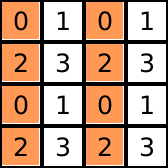

::: formula
This document is a proposal. The contents haven't been implemented yet, or
completely formalized.
:::

This document introduces two constructs Seashell provides for hardware safe
parallel access. The first construct is a _Slice_ which allows the programmer
to statically slice an array in several parts, each of which can be accessed
in parallel. The second construct is a _View_ which is the only way of accessing
several elements of a Seashell array. The two constructs together provide the
ability to perform a variety of array computations in a safe manner.

## Rationale

One of the most important benefits of reconfigurable hardware is the ability to
access multiple pieces of the memory at the same time. However proving that
an arbitrary array access is hardware safe (i.e. accesses distinct hardware
banks) at compile time can quickly become intractable.

To combat this problem, seashell provides _Views_ which can we thought of windows
that walk over the array and can access elements in the array in parallel.
Having _Views_ reduces the proof burden on the Seashell type system because
instead of having to figure out what elements are being access in each iteration,
the user specifies them exactly which allows the type system to be simpler.

However, just having _Views_ is not enough (This is an unverified claim -
Rachit). Sometimes, it the programmer might want to access different slices
of the array at the same time. If we allow unrestricted usage of views for
this i.e., allow one array to have multiple views into it, we again face the
problem of establishing mututal exlcusion between all the views in the array
which may an undecidable problem.

Instead of allowing for unrestricted views, Seashell instead asks the programmer
to _slice_ an array into mutually exclusive parts that the user wants to access
in parallel. Since _slices_ are always mututally exclusive, the burder of proof
on the type system is again reduced.

While a combination of _views_ and _slices_ is still a conservative
approximation of the the set of all safe parallel accesses, we hope that
together they are expressive enough to allow for common array programming
patterns.

## Slices in Seashell

A _Slice_ in seashell is a way of logically separating an array into separate
pieces that can be traversed in parallel. A _Slice_ only exists at the Seashell
language level and is compiled away to normal array and bank accesses by the
compiler.

For example, consider the following array $a$ of length 8 and banking factor 2.
By default, we assume interleaving banking for elements, which means alternative
elements exist in separate banks.

::: formula
This doesn't work since b & c don't access mututally exclusive bank sets.
:::


Next, we define a static slice of $a$ using the following syntax:

```
let (b, c) = slice[w=4] a
```

The `slice w=w arr` syntax gives us access to two mutually exclusive parts from
a starting array `arr`. The `w` defines the length of the window that
separates the array. The `slice` operator uses the banking structure of the
array `arr` to infer the banking structures of the resulting arrays. In this
case, Seashell will infer that `b` and `c` are both `int[4 bank (2)]` arrays.
Furthermore, since `b` and `c` are themselves just arrays, we can further
slice them into smaller arrays still.

The current syntax, however, does not allow us to create slices of the following
form:


In order to allow programmers to slice arrays in this form, we extend the
slice syntax as follows:

```
let (b, c) = slice[w=4, s=2] a
```

This syntax allows us to specify a _stride_ length that describes how many
elements get skipped over when constructing the _slices_. In this case, the
typechecker will infer from original structure of `a` that both `b` and `c`
are `int[4 bank (1)]`.

Furthermore, this syntax can also easily infer when a given slicing is invalid:


```
let (b, c) = slice[w=3, s=3] a
```

Since this array doesn't have a simple banking structure that can be inferred
from the original array `a`, Seashell will fail to typecheck it.

::: formula
I think there a simple linear relation b/w (w, s) and the size and banking
factor of the original array dimension.
:::

Finally, this syntax can naturally be extended to multiple dimensions:



```
int[4 bank(2)][4 bank(2)] a;
let (b, c) = slice[w=4, s=2][w=2] a;
```

where, `b` and `c` are `int[2][4 bank(2)]`.

## Views in Seashell

While _slices_ provide a way to divide arrays into mutally exclusive
sdifferent egments, we still need a way of accessing the elements of a _slice_ in a
safe and parallel manner. _Views_ provide a mechanism to do exactly this.
Instead of asking for a mutually exclusive slice, a _view_ asks Seashell if a
given set of accesses are hardware-safe i.e., they all correspond to
distinct banks. Notice that this constraint is different from _slices_ since
Seashell doesn't require a slice to only consist elements stored in different
banks.


The _view_ syntax is very similar to the _slice_ syntax:

```
let v_a = view[w=2, s=1, o=0] a
```

which results in a view as follows:


In a similar fashion to the _slice_ syntax, `w` dictates the width of the view,
`s` is the stride used to generate the view, and `o` is the offset at which
the view starts.

::: formula
There is no good reason why _slices_ don't have offsets. At this point, I think
the only distinction between _slices_ and _views_ is that the latter needs to
check that elements contained in it come from distinct banks.
:::

When we define an offset with a _view_, we have the following picture:


However, as previously mentioned, a _view_ needs to ensure that all elements
accessed in it are in distinct banks. Since this is not the case with this view,
Seashell will reject it.

### Views in loops

Since parallel memory access are primarirly used in conjunction with loops, we
can use _views_ with dynamic offsets:

```
for (let i = 1..10) {
    let v_a = view[w=2, s=1, o=i] a;
    let v_c = view[w=2, s=1, o=i] c;
    v_c := v_a;
}
```

Assignment b/w views corresponds to the intuitive parallel writes between two
pieces of memory. To make sure that the expression `v_c := v_a` is safe, all
Seashell need to do is make sure `v_c` and `v_a` have the same widths.

### Desugaring loop unrolls to views

This is intentionally blank...

::: formula
The current _view_ syntax is not powerful enough to allow us to desugar
unrolled loops to views. However, it should certainly be the case that this is
doable. We need to come up with modest extensions to the syntax that make this
possible somehow. - Rachit
:::

::: formula
Before writing this doc, I had thought that _slices_ and _views_ are sufficiently
different that they should be different abstracts. I'm less confident that this
true since they seems to almost be doing the same things at this point.

Having _slices_ in the surface language still seems useful, but I think there
a more core abstraction that can be written that can generalize both of these
constructs and loop unrolling.
:::
